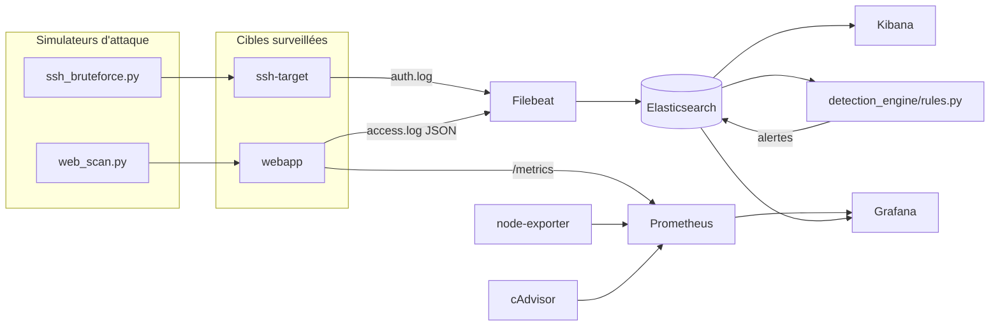

# Système de détection & monitoring de menaces

Plateforme de sécurité (mini-SIEM) et d'observabilité, déployée et testée en
conditions réelles : collecte et analyse de logs (Elasticsearch, Kibana),
métriques d'infrastructure et d'application (Prometheus, Grafana), et un
moteur de détection qui identifie des attaques réelles simulées (brute-force
SSH, scan de reconnaissance, tentatives d'injection), avec chaque règle
reliée à une technique documentée du référentiel **MITRE ATT&CK**.

**Stack :** Python · Docker · Elasticsearch · Kibana · Filebeat · Prometheus · Grafana

## 1. Ce qui a été réellement testé

Ce projet n'a pas été qu'écrit : toute la chaîne a été exécutée de bout en
bout sur cette machine — attaques simulées comprises. Preuves complètes dans
`reports/`.

- Une vraie attaque par force brute SSH (10 mots de passe testés puis succès)
  contre un conteneur SSH dédié, isolé sur le réseau Docker du projet.
- Un vrai scan de reconnaissance (26 requêtes vers des chemins inexistants)
  et 5 tentatives d'injection (SQLi, traversée de répertoire, XSS) contre une
  application web de démonstration.
- Le moteur de détection a retrouvé les **7 attaques sur 7** dans les logs
  réellement indexés dans Elasticsearch, chacune reliée à sa technique MITRE
  ATT&CK (T1110, T1595, T1190).
- Un tableau de bord Grafana réel, avec des panels vérifiés un par un
  (requêtes Prometheus exécutées et confirmées non vides).

## 2. Architecture



## 3. Le moteur de détection : trois règles, reliées à MITRE ATT&CK

| Règle | Technique MITRE | Logique |
|---|---|---|
| `ssh_brute_force` | T1110 - Brute Force | ≥ 5 échecs SSH depuis la même IP ; signale en plus si une connexion a fini par réussir (compte compromis) |
| `web_path_scanning` | T1595 - Active Scanning | ≥ 8 réponses 404 depuis la même IP (comportement d'outil de reconnaissance) |
| `injection_attempt` | T1190 - Exploit Public-Facing Application | Détection de payloads connus (SQLi, traversée de répertoire, XSS) dans les requêtes, après décodage URL |

## 4. Lancer le projet

```bash
docker compose up -d
python3 -m venv .venv && source .venv/bin/activate && pip install -r requirements.txt

# Rejoue toute la démonstration : attaques + détection
bash scripts/run_demo.sh
```

- Grafana : http://localhost:3000 (admin/admin)
- Kibana : http://localhost:5601
- Prometheus : http://localhost:9090

## 5. Tests automatisés

```bash
python -m pytest tests/ -v
```

6 tests valident la logique des règles de détection sans dépendre d'un vrai
cluster Elasticsearch (faux client), y compris un test de non-régression sur
un vrai bug rencontré pendant le développement (voir `reports/lessons_learned.md`).

## 6. Structure du dépôt

```
├── webapp/                 # Application cible (FastAPI), génère des logs JSON + métriques Prometheus
├── ssh_target/              # Conteneur SSH volontairement vulnérable (cible de brute-force)
├── attack_simulator/         # Scripts qui simulent de vraies attaques (isolées, réseau local)
├── detection_engine/          # Règles de détection, reliées à MITRE ATT&CK
├── filebeat/                   # Configuration de collecte des logs
├── prometheus/ grafana/          # Configuration des métriques et du tableau de bord
├── tests/                          # Tests unitaires du moteur de détection
└── reports/                         # Preuves d'exécution réelle + rapport explicatif
```

## 7. Limites connues

- Le parsing des logs SSH se fait côté Python (regex), pas via un pipeline
  Elasticsearch dédié : suffisant pour cette démonstration, une vraie
  plateforme utiliserait un pipeline d'ingestion structuré (Logstash/ingest
  pipeline Elasticsearch).
- cAdvisor ne remonte pas les métriques par conteneur dans cet environnement
  (VM imbriquée) — voir `reports/lessons_learned.md` pour le détail du
  diagnostic et la métrique de remplacement utilisée.
- Le moteur de détection est lancé à la demande, pas en continu (pas de
  planification automatique toutes les X secondes).
